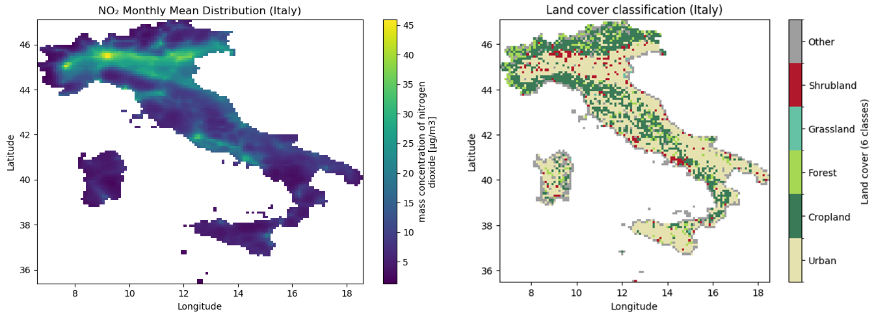
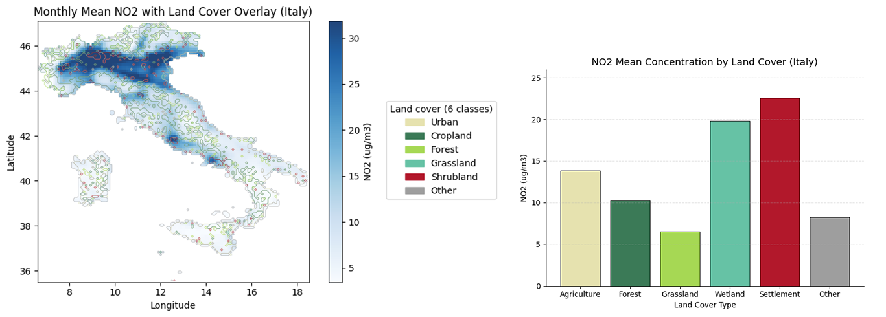

AirQualityLib
==============

Lightweight helpers for geospatial air-quality analysis, designed to support common preprocessing, aggregation, and landcover-based workflows on NetCDF datasets. Core functionality is implemented in [airqualitylib/geospatial_airquality.py](airqualitylib/geospatial_airquality.py).

<p align="center">
  
</p>

<p align="center">
  <em>
    Monthly mean NO₂ concentration and land-cover classification after preprocessing and spatial alignment (example result)
  </em>
</p>

<p align="center">
  
</p>

<p align="center">
  <em>
    Spatial overlay of NO₂ with land-cover classes and corresponding land-cover–stratified statistics (example result)
  </em>
</p>


## Features
- End-to-end geospatial air-quality workflow from NetCDF inputs to maps and statistics.
- Load air-quality rasters (NetCDF) and administrative boundaries (GeoPackage), with built-in CRS normalization.
- Clip air-quality grids to areas of interest using vector AOIs.
- Temporal aggregation: monthly mean maps from time cubes.
- Landcover support: load/reclass (default 6-class scheme), align to AQ grid, and overlay to compute per-class statistics.
- Export helpers: GeoTIFF export and plotting colormap for the 6 landcover classes.

---
## Workflow
The diagram below illustrates the typical end-to-end workflow supported by AirQualityLib, from raw air-quality and landcover NetCDF inputs to monthly aggregation, landcover-based analysis, and final maps and statistics.



---

## Install
- Conda (recommended):
	1. `conda env create -f environment.yml`
	2. `conda activate aq_env`
	3. (Optional editable install) `pip install -e .`
- PyPI-style install (uses only [pyproject.toml](pyproject.toml) deps): `pip install .`

---

## Quickstart
The following example demonstrates a minimal workflow for computing monthly NO₂ statistics over a selected country.
1) Load data
```python
import xarray as xr
from airqualitylib.geospatial_airquality import (
    load_air_quality,
    load_landcover,
    load_admin_boundaries,
    clip_to_aoi,
    monthly_mean,
    overlay_aq_with_landcover,
    landcover_stats,
)

aq = load_air_quality("example/example_data/cams.eaq.vra.ENSa.no2.l0.2022-02.nc")
lc = load_landcover("example/example_data/C3S-LC-L4-LCCS-Map-300m-P1Y-2022-v2.1.1.area-subset.72.45.30.-25.nc")
boundaries = load_admin_boundaries("example/example_data/EU_countryboundaries.gpkg")
```

2) Select an AOI (e.g., Portugal) and clip
```python
portugal = boundaries[boundaries["NAME"] == "Portugal"]
aq_clip = clip_to_aoi(aq, portugal)
```

3) Monthly mean for February 2022 and align landcover
```python
aq_feb = monthly_mean(aq_clip, month="2022-02")
aq_on_lc, lc_on_aq = overlay_aq_with_landcover(aq_feb, lc)
```

4) Summaries by landcover class
```python
stats = landcover_stats(aq_on_lc, lc_on_aq, threshold=40.0)
print(stats.head())
```

---

## Data expectations
- Air quality rasters: NetCDF with `lat`, `lon`, and a `time` dimension for time cubes.
- Landcover rasters: categorical NetCDF with `lat`/`lon`; default reclass mapping `DEFAULT_LCCS_TO_6CLASS` yields 6 macro classes.
- Boundaries: GeoPackage layer in WGS84 (auto-normalized if not).

---

## Testing
Unit tests are provided in the `tests/` directory and cover the core functionality of the library.
- Run unit tests: `pytest` 

---

## Examples
- See [example/example.ipynb](example/example.ipynb) for an end-to-end walkthrough.
- Sample data download: <[Google Drive link here](https://drive.google.com/drive/folders/1Ohk_1sAGYlQYqnZ10WQNBUb2UrqHePyH?usp=sharing)>. After downloading, place the files under [example/example_data](example/example_data).

---

## License
- MIT License; see [LICENSE](LICENSE).
